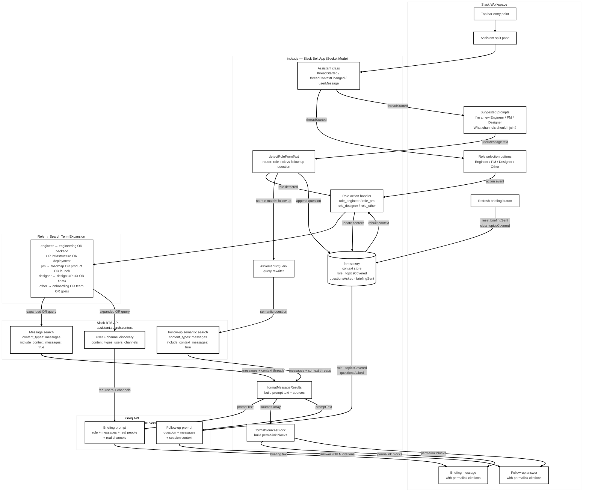

# TeamTrail

An AI-powered, stateful onboarding agent for Slack, built on Slack's **Agents & AI Apps** platform. New members open TeamTrail from the top-bar entry point, pick their role, and get a personalised briefing generated from real workspace history via Slack's Real-time Search API and LLaMA 3.3 70B via Groq — grounded in actual messages, real people, and real channels. They can keep asking questions in the same pane afterward, with full context awareness across the session.

Built for the **Slack Agent Builder Challenge 2026**.

---

## How it works

```
User opens TeamTrail from the top bar / split pane
       │
       ▼
Assistant thread starts → role buttons + suggested prompts shown
       │
       ▼
User picks a role (button click or typed prompt)  →  RTS searches workspace messages + users + channels
       │
       ▼
Groq (LLaMA 3.3 70B) generates personalised briefing, grounded in real results
       │
       ▼
Briefing posted in-thread with cited source permalinks + Refresh button
       │
       ▼
Follow-up question typed in the pane  →  RTS search  →  Groq answer with citations  →  context updated
```

---

## Features

- **Native Slack AI app surface** — lives in the top bar with a dedicated split-pane container (Slack's Agents & AI Apps feature), not a slash command
- **Role-aware onboarding** — Engineer, PM, Designer, or Other, each mapped to different RTS search terms for better recall
- **Two ways to pick a role** — explicit buttons in the thread, or fixed suggested prompts ("I'm a new Engineer, brief me") that route through the same handler
- **Real-time workspace search** via `assistant.search.context` (Slack's RTS API) — searches actual messages, users, and channels, not a static knowledge base
- **Semantic query rewriting** — bare keyword queries like `rate limiting` are rewritten to `What is the latest on rate limiting?` to trigger RTS semantic mode; OR-operator queries are left as-is for keyword recall
- **Context message inclusion** — RTS returns surrounding messages before and after each result, giving the LLM conversation-level understanding, not just isolated snippets
- **Cited sources** — every briefing and follow-up response includes permalink-backed source citations so users can jump directly to the original messages
- **Stateful per-user context** — tracks role, topics covered, and questions asked across the session; the LLM is explicitly told not to repeat topics already covered
- **Follow-up questions in-thread** — just type in the assistant pane; same RTS + Groq pipeline that used to live behind `/ask`, with session context carried over
- **Refresh briefing** button — clears state and restarts the onboarding flow
- **Graceful sparse-workspace handling** — if RTS returns no users or channels (expected in sandboxes with limited history), the LLM is prompted to say so honestly rather than hallucinate people or channel names

---

## Tech stack

| Layer | Technology |
|---|---|
| Slack framework | Slack Bolt for JavaScript (Socket Mode) |
| Slack AI surface | Agents & AI Apps — `Assistant` class (top bar + split pane) |
| AI model | Groq API — LLaMA 3.3 70B Versatile |
| Workspace search | Slack `assistant.search.context` (RTS API) |
| Transport | Socket Mode — no public URL or ngrok needed |
| State | In-memory per-user context store |
| Auth | Bot token (`xoxb-`) for Bolt; User token (`xoxp-`) for RTS |

---

## Architecture



---

## RTS API — what's actually happening

The bot makes three distinct uses of `assistant.search.context`:

**1. Role-aware message search**
On role selection, the bot expands the role into an OR-query (e.g. `engineering OR backend OR infrastructure OR deployment OR architecture` for Engineer) and searches `messages` with `include_context_messages: true`. This gives the LLM conversation threads, not just isolated messages.

**2. User and channel discovery**
A second parallel call searches `users` and `channels` with the same role-expanded query, surfacing real people and channels to name-check in the briefing. Note: in sparse sandboxes (few members, little channel history), this legitimately returns empty — the prompt handles this gracefully.

**3. Semantic follow-up search**
Typed follow-up questions are rewritten into natural-language questions before being passed to RTS, nudging the API toward semantic retrieval. Question-phrased and OR-style queries are passed through unchanged.

**User token rationale:** RTS calls use the `xoxp-` user token. Bot-token RTS calls require an `action_token`, which is only available from button/shortcut events — a typed follow-up question in the assistant pane has no such token. The user token is the correct approach, not a workaround.

### Verified test output (sandbox workspace)

```
Test 1 (message search):   ✅  5 messages returned across #all-ai-playground, #design, #engineering
Test 2 (user/channel):     ⚠️  Empty — expected in sparse sandbox (RTS known behaviour)
Test 3 (semantic + ctx):   ✅  5 messages with full before/after context threads
```

---

## Project structure

```
├── index.js            # Main bot — Assistant lifecycle, RTS calls, Groq prompts
├── test_rts.sh         # Standalone RTS smoke tester (run before deploying)
├── .env                # Secrets (not committed)
├── package.json
└── README.md
```

---

## Setup

### 1. Create a Slack app

Go to [api.slack.com/apps](https://api.slack.com/apps) and create a new app **from scratch**.

**OAuth scopes (Bot Token):**
```
channels:history
channels:read
chat:write
groups:history
groups:read
im:write
users:read
```
`assistant:write` is added automatically when you enable Agents & AI Apps in step 2 below — you don't add it manually.

**OAuth scopes (User Token):**
```
search:read
```

### 2. Enable Agents & AI Apps

In the left sidebar, go to **Agents & AI Apps**:
- Toggle **Agent or Assistant** on
- Fill in the **Agent or Assistant Overview** (shown in the split pane before any message is sent)
- Under **Suggested Prompts**, choose **Fixed** and add:

| Title | Message |
|---|---|
| I'm a new Engineer | I'm a new Engineer, brief me |
| I'm a new PM | I'm a new Product Manager, brief me |
| I'm a new Designer | I'm a new Designer, brief me |
| What channels should I join? | What channels should I join? |

Save.

### 3. Event subscriptions

Enable Socket Mode first, then under **Event Subscriptions → Subscribe to bot events**, add:
```
assistant_thread_started
assistant_thread_context_changed
message.im
member_joined_channel
```

**App-level token:** Create one with `connections:write` scope — this is your `SLACK_APP_TOKEN`.

### 4. Install (or reinstall) the app

If you'd already installed the app before enabling Agents & AI Apps, you must **reinstall** for the new `assistant:write` scope to take effect. Confirm it appears in the scope list before clicking Allow.

### 5. Clone and install

```bash
git clone <repo-url>
cd teamtrail
npm install
```

### 6. Configure environment

Create a `.env` file:

```env
SLACK_BOT_TOKEN=xoxb-...
SLACK_USER_TOKEN=xoxp-...
SLACK_SIGNING_SECRET=...
SLACK_APP_TOKEN=xapp-...
GROQ_API_KEY=...
```

### 7. Smoke-test RTS before starting the bot

```bash
chmod +x test_rts.sh
./test_rts.sh
```

This runs three RTS calls directly against your workspace and pretty-prints the JSON. Confirm Test 1 and Test 3 return messages before proceeding. Test 2 returning empty in a new workspace is normal.

### 8. Start the bot

```bash
node index.js
```

You should see:
```
⚡ TeamTrail is running!
```

---

## Usage

1. Open TeamTrail from the **top bar** in Slack (next to search)
2. Pick a role — click a button, or use one of the suggested prompts
3. A personalised briefing posts in the same pane within a few seconds, with cited sources
4. Type any follow-up question directly in the pane — the bot remembers what's already been covered and won't repeat itself
5. Click **🔄 Refresh my briefing** at any time to restart

---

## Environment variables reference

| Variable | Description |
|---|---|
| `SLACK_BOT_TOKEN` | `xoxb-` token — Bolt framework auth |
| `SLACK_USER_TOKEN` | `xoxp-` token — RTS API calls |
| `SLACK_SIGNING_SECRET` | Request verification |
| `SLACK_APP_TOKEN` | `xapp-` token — Socket Mode connection |
| `GROQ_API_KEY` | Groq API key for LLaMA 3.3 inference |

---

## Known limitations

- **State is in-memory** — context resets on process restart. A Redis or SQLite layer would make it persistent across deployments. Per Slack's guidance for Agents & AI Apps, only metadata (role, topics, question text) is stored — never raw Slack message content.
- **User/channel discovery** returns empty in sparse workspaces — this is an RTS API behaviour, not a bug. The LLM prompt handles it honestly.
- **Single workspace** — the user token is workspace-scoped. Multi-workspace support would require per-installation token storage.
- **No file search** — `assistant.search.context` supports `files` as a content type but the bot currently searches `messages`, `users`, and `channels` only.
- **No MCP server integration yet** — Slack's Agents & AI Apps settings expose an optional Slack MCP Server toggle (search/post/read via MCP tools instead of direct RTS calls). Not enabled in this build.

## Known gotchas (Bolt for JS, `@slack/bolt@4.7.3`)

- **`app.use(assistant)` is wrong** — it pushes the raw `Assistant` instance into Bolt's middleware array without converting it, which crashes every incoming event with `middleware[toCallMiddlewareIndex] is not a function`. The correct call is **`app.assistant(assistant)`**, which internally calls `assistant.getMiddleware()` first.
- **`say()` inside `app.action()` doesn't reliably target the active assistant thread** for block actions fired from inside the split pane — messages can end up posted to the App Home History tab instead of the live Chat pane. Posting explicitly via `client.chat.postMessage` with `body.channel.id` and `body.container.thread_ts` keeps the reply anchored to the right thread.